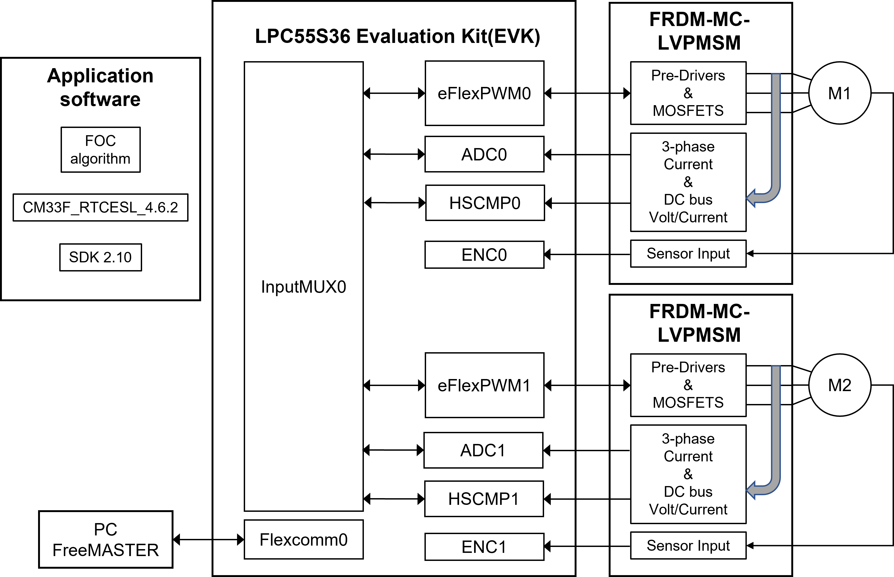
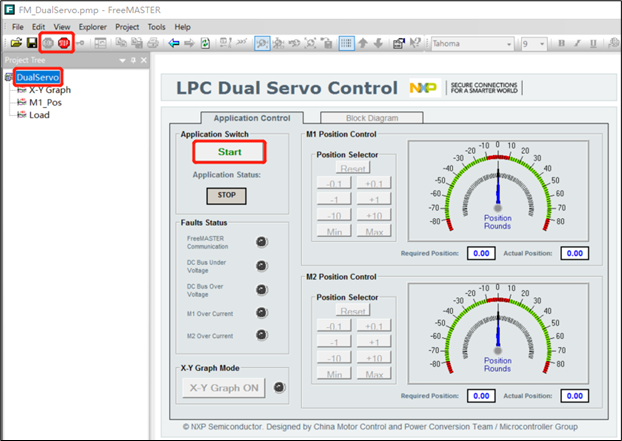
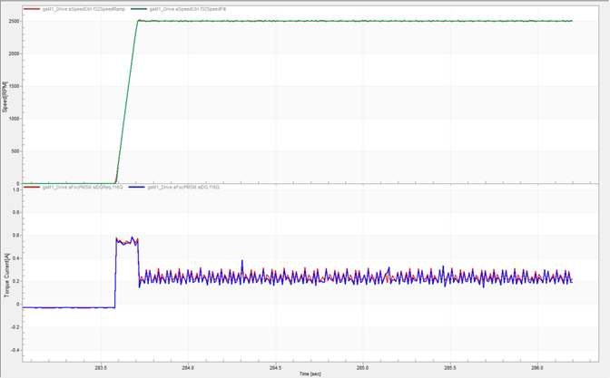
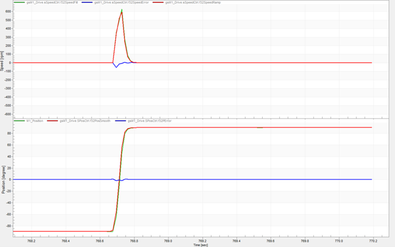

# NXP Application Code Hub

## LPC553x dual-servo motor control

This application note describes the dual servo demo with the NXP LPC55S36&nbsp;processor. It also can be used as a reference for motor control application&nbsp;developing based on other products.

This demo includes LPCXpresso55S36, two FRDM-MC-PMSM driver boards, and two three-phase servo motors. The LPC553x/ LPC55S3x processor samples the currents and voltages of the motor through the ADC. The ENC module receives the encoder signal to obtain the rotor position and speed, and generates PWM based on the FOC algorithm to drive the motor. At the same time, UART can be used to communicate with the FreeMASTER to achieve command sending, variable observation, and other functions that are convenient for users to debug. Finally, precise position control and smooth speed regulation can be achieved.

#### Boards: LPCXpresso55S36

#### Categories: Motor control
#### Peripherals: ADC, GPIO, CLOCKS, PWM, UART
#### Toolchains: IAR

## Table of Contents
1. [System Structure](#step1)
2. [Software](#step2)
3. [Hardware](#step3)
4. [Setup](#step4)
5. [Results](#step5)
6. [Support](#step6)
7. [Release Notes](#step7)

## 1. System Structure

This figure presents the system structure block diagram of this dual servo demo.

•  LPCXpresso55S36 designed by NXP contains the LPC553x/LPC55S3x chip and peripheral interfaces.

•  FRDM-MC-LVPMSM designed by NXP is a motor driver board that contains driver bridges, analog sampling circuits, and an encoder interface.

•  M1 and M2 are the servo motors that include 1000 lines encoder.

•  eFlexPWM, ENC, ADC are on-chip peripherals, used for motor control, encoder signal acquisition, and analog acquisition respectively.

•  InputMUX is an input multiplexing module that can provide different signal path options for the internal peripherals of the chip. In this demo, it is responsible for providing signal connections for PWM synchronization, ADC hardware triggering, and fault protection.

•  The application software is running on LPC553x/LPC55S3x which includes the FOC algorithm, CM33_RTCESL_4.6.2 (Real-Time Control Embedded Software Motor Control and Power Conversion Libraries), and SDK 2.10.

•  Flexcomm provides various peripheral function options that can be configured into USART, SPI, I2C, I2S functions through software. Here we configure the USART function to realize the communication between the FreeMASTER debugging tool and LPC553x/LPC55S3x to demonstrate the user's operation.

## 2. Software

- CM33_RTCESL_4.6.2

- SDK: 2.10

- FreeMASTER 3.1.2

- IAR Workbench IDE 8.50.9

## 2. Hardware

-  LPC55S36-EVK REV B

-  Two FRDM-MC-LVPMSM boards

-  Two 24 V servo motors

-  Micro USB cable

## 3. Setup

1. Plug the LPCXpresso55S36 and FRDM-MC-LVPMSM board together via Arduino interface, connect motor wires and encoder interface.

   

2. Power on 24 V adapter to power on the FRDM-MC-LVPMSM board.

3. Connect LPCXpresso55S36 and PC via USB interface.

4. Open FM_DualServo.pmp in the software package. (FREEMATER version must be not lower than 3.1.2)

5. Click the GO! button to enable the communication between PC and LPC553x/LPC55S3x.

   

6. Click the DualServo page.

7. Click the Start button to enable demo.

8. Operate the demo by clicking other buttons on the control page.

## 4. Results

All the following experimental results are tested when the motor is loaded with a light plastic ring. And all the figures come from the FreeMASTER.

Below figure shows the speed and current waveforms when the motor startup is at 2500 RPM. The red line is speed requirement, the green line is actual speed, and blue line is torque current. We can see that it can accelerate to 2500 RPM within 0.13 s, and the overshoot is very small.

As shown in [Figure 18](#_bookmark22), the top waveforms show the speed response and the bottom waveforms show the position response. The red line is the requirement, the green line is the actual value, and the blue line shows the error between them. After setting the 180o position requirement, it takes about 0.1 seconds to reach the desired position. We can see that the error of dynamic response is small and the static response is very stable.

Please refer to the application note for the details: https://www.nxp.com.cn/docs/en/application-note/AN13569.pdf

## 5. Support
#### Project Metadata
<!----- Boards ----->

<!----- Categories ----->

<!----- Peripherals ----->
    

<!----- Toolchains ----->

Questions regarding the content/correctness of this example can be entered as Issues within this GitHub repository.

>**Warning**: For more general technical questions regarding NXP Microcontrollers and the difference in expected funcionality, enter your questions on the [NXP Community Forum](https://community.nxp.com/)

## 6. Release Notes
| Version | Description / Update                           | Date                        |
|:-------:|------------------------------------------------|----------------------------:|
| 1.0     | Initial release on Application Code HUb        | June 5nd 2023 |

